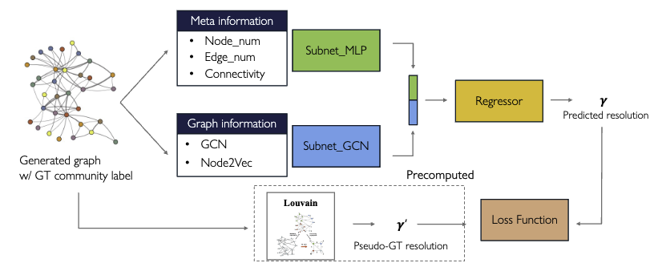

# Dual Neural Network for Community Detection

Our method enhances community detection performance by estimating optimal resolution parameters based on graph structures.
By utilizing the power of neural networks, we can get optimal resolution parameters.

Our Github repository consists of the following steps:
1. Setup the enviroment.
2. Reorganizing file/folder structure.
3. Precomputing *peak resolution parameters.
4. Training proposed network.
5. 5 Testing proposed network.




## 1 Setup the enviroment
### Environments
- Python 3.9.19
- Cuda compiler 11.2

### Install from conda
```
conda create -n mica100 python=3.9.2        # Create a python virtual environment
source activate mica100                     # Activate the virtual environment
pip install MICA                            # Install MICA and its dependencies
```

### Install from pip
```
conda create -n mica100 python=3.9.2        # Create a python virtual environment
source activate mica100                     # Activate the virtual environment
git clone https://github.com/jyyulab/MICA   # Clone the repo
cd MICA                                     # Switch to the MICA root directory
pip install .                               # Install MICA from source
mica -h                                     # Check if mica works correctly
```


## 2 Reorganizing file/folder structure.
We use 4 dataset as below:
 - `Real-world dataset` (for test)
 - `Synthesized real-world-like dataset` (for train)
 - `TC1 dataset` (for test)
 - `Synthesized TC1-like dataset` (for train)

Each file and folder structure is unique.

For example, the `real-world dataset` and the `TC1 dataset` are saved using a nested directory structure. 
In contrast, the `synthesized real-world-like dataset` and the `synthesized TC1-like dataset` use a flat directory structure.

Additionally, the `real-world dataset` files are named with descriptive text, such as "dolphin," "football," and "karate." 
On the other hand, the `TC1 dataset` files are named using sequential indexing.

Therefore, we have to re-organize given dataset structures.

For `real-world dataset` and `TC1 dataset`, we type below scripts respectively.
```
python N1-organize_dataset.py                        \          # 
  --dataset_path 'path/to/your/`real-world_dataset`' \          # 
  --isit_hierarchy 1                                 \          #
  --testset real                                                #


python N1-organize_dataset.py                        \          # 
  --dataset_path 'path/to/your/`TC1-dataset`'        \          # 
  --isit_hierarchy 1                                 \          #
  --testset TC1                                                 #
```


## 3 Precomputing *peak resolution parameters.
\* peak means best performed resolution parameter according to each graph data.

Before train our network model, we have to get optimal resolution parameters according to each graph structures.
In this process, we can get each optimal parameters by measuring nmi scores iteratively.

For `real-world dataset` and `TC1 dataset`, we type below scripts respectively.
```
python N1-organize_dataset.py                        \          # 
  --dataset_path 'path/to/your/`real-world_dataset`' \          # 
  --root_path 'path/to/your/`real-world_dataset`'    \          #
  --testset real                                                #

** : if our path is './root/proj/data/train/', dataset_path would be 'train' and root_path would be './root/proj/data/'

python N1-organize_dataset.py                        \          # 
  --dataset_path 'path/to/your/`TC1-dataset`'        \          # 
  --root_path 'path/to/your/`TC1_dataset`'           \          #
  --testset TC1                                                 #
```


## 4 Training proposed network.
we mainly train on synthesized dataset, and then we test/eval on given dataset.

For `real-world dataset` and `TC1 dataset`, we type below scripts respectively.
```
python N3-train.py                                                  \          # 
  --train_path 'path/to/your/`synthesized real-world-like dataset`' \          # 
  --test_path 'path/to/your/`real-world_dataset`'                   \          #
  --testset real                                                    \          #
  --pth real                                                                   #


python N3-train.py                                                  \          # 
  --train_path 'path/to/your/`synthesized TC1-like dataset`'        \          # 
  --test_path 'path/to/your/`TC1 dataset`'                          \          #
  --testset TC1                                                     \          #
  --pth TC1                                                                    #
```


## 5 Testing proposed network.
For `real-world dataset` and `TC1 dataset`, we type below scripts respectively.
```
python N4-test.py                                                  \          # 
  --test_path 'path/to/your/`real-world_dataset`'                  \          #
  --model_path 'path/to/your/model_checkpoints'                    \          # 
  --testset real                                                   \          #


python N4-test.py                                                  \          # 
  --test_path 'path/to/your/`TC1 dataset`'                         \          #
  --model_path 'path/to/your/model_checkpoints'                    \          # 
  --testset TC1                                                    \          #
```


## 5 Visualizing results
We utilze `N5-visualize-result.py` file to get proper files(.xlsx/.csv) and manually edit results in editing tools such as Microsoft Powerpoint and Excel.
Please see the submitted paper to detailed visualization.
